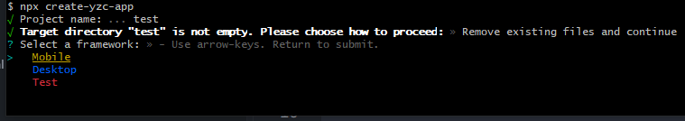

# 使用
## 安装
```
npm i create-yzc-app -g
```
## 查看版本号
```
npx create-yzc-app -v
```
## 创建项目
执行
```
npx create-yzc-app
```


# 开发
## create-yzc-app工程
该工程用于开发`create-yzc-app`命令行工具。
地址：[http://gitlab.ahyzc.com/yzc-public-tools/create-yzc-app.git](http://gitlab.ahyzc.com/yzc-public-tools/create-yzc-app.git)
- ts开发，unbuild打包
- 提供-template、-t参数，用于指定模板地址
- 提供-version、-v参数，用于查看版本号
- 提供-help、-h参数，用于查看帮助信息
- 该依赖被npm安装后，自动拉取git模版库
## 模板库
桌面端模版库地址：[http://gitlab.ahyzc.com/yzc-public-tools/template-desktop.git](http://gitlab.ahyzc.com/yzc-public-tools/template-desktop.git)
移动端模版库地址：[http://gitlab.ahyzc.com/yzc-public-tools/template-mobile.git](http://gitlab.ahyzc.com/yzc-public-tools/template-mobile.git)
### 桌面端模版库
- vite4 + vue3 + ts + element-plus
- node16(由于jenkins服务器环境问题，暂时不支持node18+)
### 移动端模版库
- vite4 + vue3 + ts + uni-app + wot-design-uni
- node16(由于jenkins服务器环境问题，暂时不支持node18+)